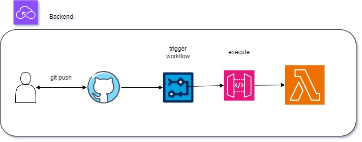

<strong>Automatische Bereitstellung: </strong>

Bei jedem Commit in den main-Branch wird automatisch eine Bereitstellung deiner Serverless-Anwendung in deinem AWS-Account ausgelöst.

<strong>Infrastruktur als Code: </strong>

Der Workflow ermöglicht die Nutzung von Infrastruktur als Code, da die Bereitstellungslogik direkt im Workflow-Code definiert ist. Dies fördert bewährte Praktiken für die Verwaltung von Infrastruktur.

<strong> Erweiterbarkeit der Funktionen: </strong>

Die Automatisierung des Deployments ermöglicht es, schnell und effizient neue Funktionen zu implementieren und zu testen. Das Hinzufügen von Funktionen kann nahtlos in den Entwicklungsprozess integriert werden.